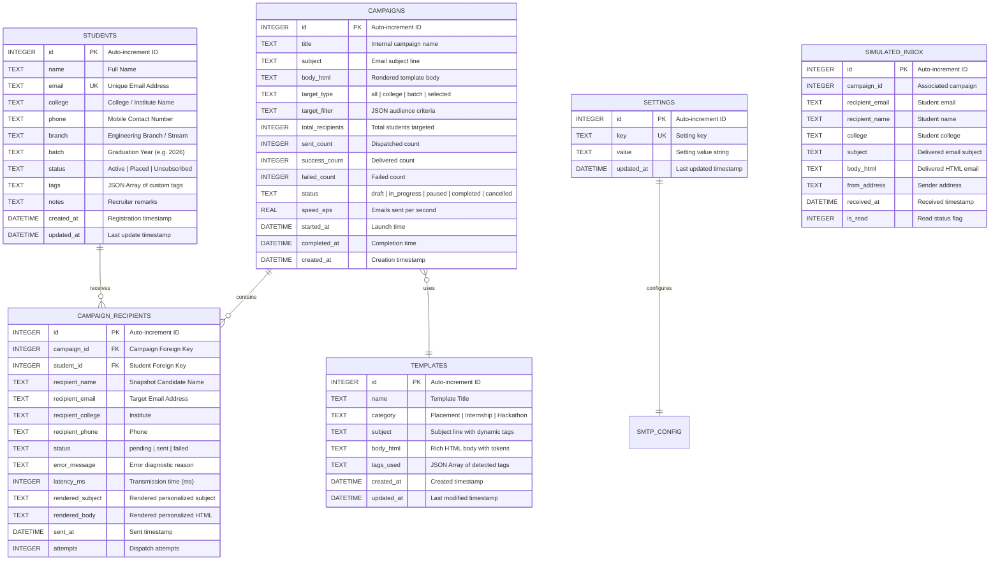

# Aparaitech Software &bull; Database Schema Documentation

This document describes the SQLite relational database schema utilized by the **Aparaitech Student Email Blast Web Application**.

---

## Entity Relationship Overview

---

## Data Dictionaries

### 1. `students` Table
Stores registered student profiles across participating institutions.

| Column | Data Type | Nullable | Default | Description |
| :--- | :--- | :--- | :--- | :--- |
| `id` | `INTEGER` | **No** | Auto | Primary Key |
| `name` | `TEXT` | **No** | - | Student candidate full name |
| `email` | `TEXT` | **No** | - | Unique email address (indexed) |
| `college` | `TEXT` | **No** | - | Institution / University name (indexed) |
| `phone` | `TEXT` | Yes | `NULL` | Student contact telephone number |
| `branch` | `TEXT` | Yes | `'Computer Science'` | Discipline / Degree (e.g. AI, IT, ECE) |
| `batch` | `TEXT` | Yes | `'2026'` | Year of graduation (indexed) |
| `status` | `TEXT` | Yes | `'Active'` | `'Active'`, `'Placed'`, `'Unsubscribed'` |
| `tags` | `TEXT` | Yes | `'[]'` | JSON encoded tags array |
| `notes` | `TEXT` | Yes | `''` | Recruiter internal notes |
| `created_at`| `DATETIME`| Yes | `CURRENT_TIMESTAMP` | Creation date |
| `updated_at`| `DATETIME`| Yes | `CURRENT_TIMESTAMP` | Last updated date |

---

### 2. `templates` Table
Stores pre-built and custom recruitment email templates with personalization tags.

| Column | Data Type | Nullable | Default | Description |
| :--- | :--- | :--- | :--- | :--- |
| `id` | `INTEGER` | **No** | Auto | Primary Key |
| `name` | `TEXT` | **No** | - | Template identifier title |
| `category` | `TEXT` | Yes | `'Placement Drive'` | Category (Placement, Internship, etc.) |
| `subject` | `TEXT` | **No** | - | Subject line with `{Tag}` tokens |
| `body_html` | `TEXT` | **No** | - | Complete HTML template body |
| `tags_used` | `TEXT` | Yes | `'["{Name}"]'` | JSON array of detected tags |
| `created_at`| `DATETIME`| Yes | `CURRENT_TIMESTAMP` | Creation date |
| `updated_at`| `DATETIME`| Yes | `CURRENT_TIMESTAMP` | Last modification date |

---

### 3. `campaigns` Table
Tracks email blast campaigns, execution state, progress, and speed metrics.

| Column | Data Type | Nullable | Default | Description |
| :--- | :--- | :--- | :--- | :--- |
| `id` | `INTEGER` | **No** | Auto | Primary Key |
| `title` | `TEXT` | **No** | - | Recruiter campaign title |
| `subject` | `TEXT` | **No** | - | Email subject template |
| `body_html` | `TEXT` | **No** | - | Email body template |
| `target_type` | `TEXT` | Yes | `'all'` | `'all'`, `'college'`, `'batch'`, `'selected'` |
| `target_filter` | `TEXT`| Yes | `''` | JSON metadata of applied filters |
| `total_recipients` | `INTEGER` | Yes | `0` | Total candidates queued |
| `sent_count` | `INTEGER` | Yes | `0` | Total processed |
| `success_count` | `INTEGER` | Yes | `0` | Total delivered successfully |
| `failed_count` | `INTEGER` | Yes | `0` | Total delivery failures |
| `status` | `TEXT` | Yes | `'draft'` | `'draft'`, `'in_progress'`, `'paused'`, `'completed'`, `'cancelled'` |
| `speed_eps` | `REAL` | Yes | `0` | Speed in emails per second |
| `started_at` | `DATETIME` | Yes | `NULL` | Blast start time |
| `completed_at` | `DATETIME` | Yes | `NULL` | Blast finish time |
| `created_at` | `DATETIME` | Yes | `CURRENT_TIMESTAMP` | Creation time |

---

### 4. `campaign_recipients` Table
Stores audit logs and delivery diagnostics per individual student per campaign.

| Column | Data Type | Nullable | Default | Description |
| :--- | :--- | :--- | :--- | :--- |
| `id` | `INTEGER` | **No** | Auto | Primary Key |
| `campaign_id` | `INTEGER` | **No** | - | Foreign Key -> `campaigns(id)` ON DELETE CASCADE |
| `student_id` | `INTEGER` | Yes | `NULL` | Foreign Key -> `students(id)` ON DELETE SET NULL |
| `recipient_name` | `TEXT` | **No** | - | Candidate name at dispatch |
| `recipient_email` | `TEXT` | **No** | - | Candidate email address |
| `recipient_college`| `TEXT`| Yes | - | Candidate college |
| `recipient_phone` | `TEXT` | Yes | - | Candidate phone number |
| `status` | `TEXT` | Yes | `'pending'` | `'pending'`, `'sent'`, `'failed'` |
| `error_message` | `TEXT` | Yes | `''` | Diagnostic reason if failed |
| `latency_ms` | `INTEGER` | Yes | `0` | Transmission latency in milliseconds |
| `rendered_subject` | `TEXT` | Yes | `NULL` | Subject with personalized tags substituted |
| `rendered_body` | `TEXT` | Yes | `NULL` | HTML body with personalized tags substituted |
| `sent_at` | `DATETIME` | Yes | `NULL` | Dispatch timestamp |
| `attempts` | `INTEGER` | Yes | `0` | Number of dispatch attempts |

---

### 5. `settings` Table
Key-value configuration store for SMTP credentials, delivery modes, and company branding.

| Key | Example Value | Description |
| :--- | :--- | :--- |
| `mailer_mode` | `'sandbox'` or `'smtp'` | Active email delivery engine |
| `smtp_host` | `'smtp.gmail.com'` | SMTP Server Hostname |
| `smtp_port` | `'587'` | Port number (587 or 465) |
| `smtp_secure` | `'false'` | TLS / SSL connection flag |
| `smtp_user` | `'recruitment@aparaitech.org'` | SMTP Username |
| `smtp_pass` | `••••••••` | SMTP Password / App Password |
| `from_name` | `'Aparaitech Software Recruitment Team'` | Sender display name |
| `from_email` | `'recruitment@aparaitech.org'` | Sender from email |
| `send_delay_ms` | `'300'` | Throttling delay between emails (ms) |
| `simulate_failure_rate` | `'5'` | Sandbox test failure rate percentage |
| `company_name` | `'Aparaitech Software'` | Organization Name |
| `company_website` | `'https://aparaitech.org'` | Official website link |
